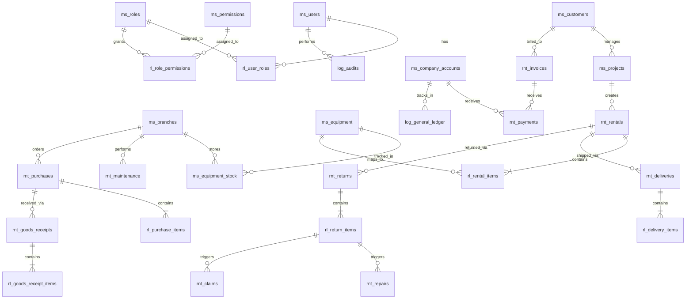

# Database Refactoring Plan: Dynamic RBAC & Naming Convention

This plan outlines the restructuring of the EquipRent Enterprise database schema to fully support Dynamic Role-Based Access Control (RBAC) and strict prefix-based table naming conventions (`ms_`, `rnt_`, `rl_`, `log_`).

## User Review Required

> [!IMPORTANT]  
> Please review the Entity Relationship Diagram (ERD) below. Once you approve this structure, I will generate the final, fully-compliant SQL DDL script and update the `database_schema.md` artifact.

## Open Questions

- Are there any specific index constraints you'd like me to add beyond the standard `UNIQUE(user_id, role_id)` and primary/foreign keys?
- For the `log_inventory_movements`, should it maintain hard foreign keys to the transactions (like `reference_id`), or keep it loosely coupled as a `VARCHAR` to avoid cascading issues?

## Proposed Revised ERD

## Table Structure Breakdown

### 1. Master Data (`ms_`)
- `ms_users` (Removed hardcoded role)
- `ms_roles` (Dynamic role definitions)
- `ms_permissions` (Dynamic permission library)
- `ms_customers`
- `ms_projects`
- `ms_equipment`
- `ms_equipment_stock`
- `ms_branches`
- `ms_drivers`
- `ms_vehicles`
- `ms_company_accounts`

### 2. Junction / Relation Tables (`rl_`)
- `rl_user_roles` (Many-to-Many mapping Users ↔ Roles)
- `rl_role_permissions` (Many-to-Many mapping Roles ↔ Permissions)
- `rl_rental_items`
- `rl_delivery_items`
- `rl_return_items`
- `rl_purchase_items`
- `rl_goods_receipt_items`

### 3. Transaction Data (`rnt_`)
- `rnt_rentals`
- `rnt_deliveries`
- `rnt_returns`
- `rnt_repairs`
- `rnt_claims`
- `rnt_maintenance`
- `rnt_purchases`
- `rnt_goods_receipts`
- `rnt_invoices`
- `rnt_payments`
- `rnt_stock_transfers`

### 4. History & Logs (`log_`)
- `log_audits` (Tracking user actions)
- `log_inventory_movements` (Tracking stock flow)
- `log_general_ledger` (Tracking cash flow history)

## Execution Plan
Once approved, I will generate the complete SQL DDL script implementing this exact structure, including `UNIQUE` constraints on all `rl_` junction tables and proper foreign keys matching Spring Boot JPA conventions.
